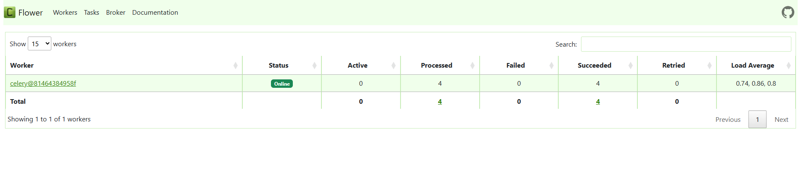

# 📊 Airflow User Data Pipeline

This repository contains a modular Airflow 3.0.0, Postgres, Flower pipeline designed to extract, process, and store user-related data. It includes DAG definitions, custom decorators, and auxiliary scripts, all organized for clarity and maintainability.

---

## 📁 Project Structure

### `dags/`
Core DAGs handling the data flow across different stages:

- `create_table/user_processing.py` – initializes required database tables
- `extract_user/user_processing_extract_user.py` – handles user data extraction
- `process_user/user_processing_process_user.py` – processes the extracted user data
- `store_user/user_processing_store_user.py` – persists the processed data

### `my-sdk/my_sdk/decorators/`
Reusable components to enhance pipeline functionality:

- `sql.py` – SQL decorators for streamlined task definitions
- `__init__.py` – initializes decorator modules

### 🔧 Utility Scripts (root level)
Single-responsibility helpers for branching, grouping, messaging, and SQL ops:

- `branch.py`, `group.py`, `user.py`, `xcom.py`, `celery.py`, `sql.py`

### 📄 Configuration
- `pyproject.toml` – project settings and dependencies
- `README.md` – documentation file

---

## 🚀 Getting Started

1. Ensure [Apache Airflow](https://airflow.apache.org/) is installed and configured.
2. Place the repository files in your Airflow `dags` directory or configure Airflow to read from this structure.
3. Customize DAG parameters and decorators to fit your data sources and targets.
4. Deploy and monitor via the Airflow UI or CLI.

---

## 📜 License

This project is licensed under the MIT License. See the `LICENSE` file for details. These are basic DAGs file for testing, feel free to change, update and create new ones.

---

...

---

